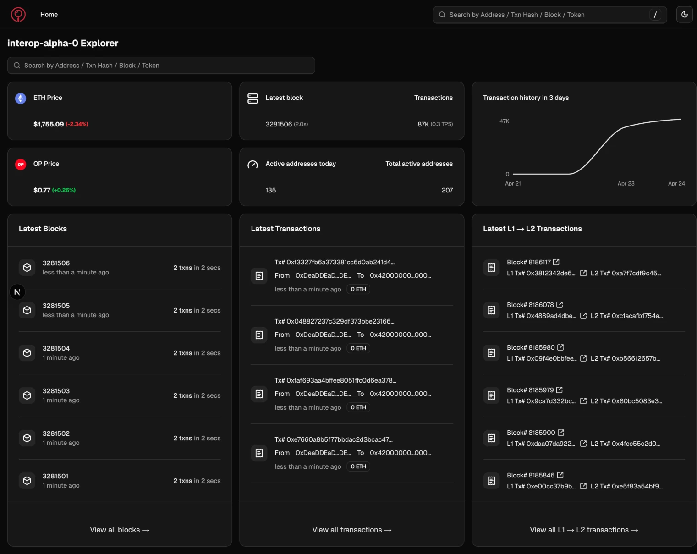

# 🔎 SuperScan

SuperScan is a transaction explorer tailored specifically for the [OP Stack](https://docs.optimism.io/stack/getting-started) and the [Optimism Superchain](https://docs.optimism.io/superchain/superchain-explainer). It's focused on being lightweight so that anyone can run it locally next to a [Superchain simulator](https://github.com/ethereum-optimism/supersim) or any other compatible OP Stack based rollup.



### 🚀 Quick Start using Supersim

[Supersim](https://github.com/ethereum-optimism/supersim) is a local development environment tool designed to simulate the Optimism Superchain for developers building multi-chain applications. It provides a simplified way to test and develop applications that interact with multiple chains within the Superchain ecosystem.


You can get SuperScan running along Supersim in one minute.
First, clone the repo and install dependencies:

```sh
git clone https://github.com/walnuthq/super-scan.git
pnpm install
```

Next, build SuperScan with Supersim support:

```sh
pnpm build-super-scan
```

Then start Supersim with autorelay enabled:

```sh
supersim --interop.autorelay
```

In a second terminal, launch the indexer:

```sh
pnpm super-indexer
```

Finally, in a third terminal launch 2 explorers for the 2 rollups spawned by Supersim using this command:

```sh
pnpm start-super-scan
```

You can follow along the [Supersim tutorial](https://github.com/ethereum-optimism/supersim?tab=readme-ov-file#example-b-l2-to-l2-send-an-interoperable-superchainerc20-token-from-chain-901-to-902) to perform a cross-chain ERC20 transaction and explore it at http://localhost:3001 and http://localhost:3002.

### ✨ Features

- Lightweight and Open Source: The code and dependencies are designed to be minimalistic to let you easily customize your explorer for your own rollup needs.
- Superchain Interop support: This explorer is purpose-built for the Optimism Superchain, it ensures 100% compatibility with the OP Stack and provides additional support for Superchain features such as cross-chain message passing.
- [Supersim Fork mode support](https://github.com/ethereum-optimism/supersim#-fork-mode): Explore locally any of the available chains in a superchain network of the [superchain registry](https://github.com/ethereum-optimism/superchain-registry). (COMING SOON)
- Cross-chain call traces: explore L2 to L2 contract call traces. (COMING SOON)
- Additional support for sending and relaying cross-chain contract calls, displaying cross-chain event reads. (COMING SOON)

### 🎬 Getting Started Video

[Here's a video walkthrough](https://www.loom.com/share/3b79f0b25e44443eb16d296aba021764) on how to launch the explorer locally configured for OP Sepolia testnet.

### 🧑‍🔬 Advanced Configuration

Copy `.env.local.op-sepolia` into `.env.local` at the root of your repository as a starting point for your custom configuration.

```sh
cp .env.local.op-sepolia .env.local
```

You'll need to populate the environment variables with your own values to properly configure your L1 and L2 chains:

```
NEXT_PUBLIC_L1_CHAIN_ID="11155111"
NEXT_PUBLIC_L1_NAME="Sepolia"
NEXT_PUBLIC_L1_RPC_URL="https://ethereum-sepolia-rpc.publicnode.com"
NEXT_PUBLIC_L2_CHAIN_ID="11155420"
NEXT_PUBLIC_L2_NAME="OP Sepolia"
NEXT_PUBLIC_L2_RPC_URL="https://optimism-sepolia-rpc.publicnode.com"
```

You can get free node rpcs url by signing up to services such as [Alchemy](https://www.alchemy.com/), [Infura](https://www.infura.io/) or [QuickNode](https://www.quicknode.com/).

If you don't want to run the explorer with your own chain setup, you will find all the necessary environment variables in `.env.local.op-sepolia` and `.env.local.op-mainnet` to configure the explorer with OP Sepolia or OP Mainnet respectively.

If you want to be able to use the Write Contract feature on verified contracts, you will also need to provide a [Reown](https://docs.reown.com/) project ID.

```
NEXT_PUBLIC_REOWN_PROJECT_ID="REOWN_PROJECT_ID"
```

### 🗂️ Indexer Configuration

To run the indexer, first set up your `DATABASE_URL` in `.env.local` (we use SQLite by default, but you can switch to PostgreSQL by changing the Prisma provider in `prisma/schema.prisma`).

```
DATABASE_URL="file:dev.db"
```

Then you can sync your local database with the Prisma schema:

```sh
pnpm prisma:db:push
```

Now you will be able to start indexing the blockchain by running the `op-indexer` command:

```sh
pnpm op-indexer
```

You should start seeing blocks getting indexed in your terminal, and you can explore the state of your local database using Prisma studio:

```sh
pnpm prisma:studio
```

If you need to change the Prisma schema at some point, make sure to regenerate the Prisma client and push to your local database:

```sh
pnpm prisma:generate
pnpm prisma:db:push
```

Indexing a blockchain puts a heavy load on the RPC endpoint, as you need to perform many JSON-RPC requests to fully index a block (along with transactions and logs).
When indexing non-local chains you will probably encounter 429 errors related to rate-limiting, you may provide up to 5 fallback RPC URLs in case this happens.

```
NEXT_PUBLIC_L1_FALLBACK1_RPC_URL="https://sepolia.drpc.org"
NEXT_PUBLIC_L2_FALLBACK1_RPC_URL="https://optimism-sepolia.drpc.org"
NEXT_PUBLIC_L1_FALLBACK2_RPC_URL="https://endpoints.omniatech.io/v1/eth/sepolia/public"
NEXT_PUBLIC_L2_FALLBACK2_RPC_URL="https://endpoints.omniatech.io/v1/op/sepolia/public"
NEXT_PUBLIC_L1_FALLBACK3_RPC_URL="https://1rpc.io/sepolia"
NEXT_PUBLIC_L2_FALLBACK3_RPC_URL="https://sepolia.optimism.io"
NEXT_PUBLIC_L1_FALLBACK4_RPC_URL="https://eth-sepolia.g.alchemy.com/v2/FALLBACK4_API_KEY"
NEXT_PUBLIC_L2_FALLBACK4_RPC_URL="https://opt-sepolia.g.alchemy.com/v2/FALLBACK4_API_KEY"
NEXT_PUBLIC_L1_FALLBACK5_RPC_URL="https://sepolia.infura.io/v3/FALLBACK5_API_KEY"
NEXT_PUBLIC_L2_FALLBACK5_RPC_URL="https://optimism-sepolia.infura.io/v3/FALLBACK5_API_KEY"
```

You can pass several parameters to the indexer to control the indexing range and execution:

- `--l2-from-block` (short `-f`, defaults to latest block) start indexing from this L2 block.
- `--l2-index-block` (short `-b`) index this particular L2 block number.
- `--l2-index-delay` (short `-d`, defaults to 2000) delay in ms between indexing 2 L2 blocks to avoid overloading the RPC.
- `--l1-from-block` (defaults to latest block) start indexing from this L1 block.
- `--l1-index-block` index this particular L1 block number.
- `--l1-index-delay` (defaults to 12000) delay in ms between indexing 2 L1 blocks to avoid overloading the RPC.

Example of running the indexer:

```sh
pnpm op-indexer -f 123416717 --l1-index-block 20426733 --l1-index-block 20426726 -d 500
```

### 🕵️ Running the Explorer

When you're done configuring your environment variables, you can build the app:

```sh
pnpm build
```

Make sure the indexer is running, then launch the explorer to see it live at `http://localhost:3000`

```sh
pnpm start
```

Alternatively, you can launch the explorer in dev mode if you want to customize it:

```sh
pnpm dev
```

### 🤝 Contributing

Contributions are encouraged, but please open an issue before making any major changes to ensure your changes will be accepted.
